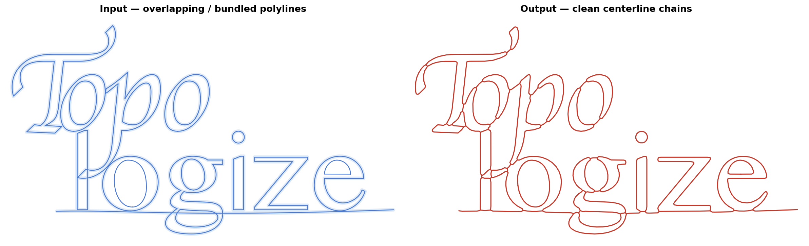

# topologize

**Convert messy, overlapping polylines into a clean topological skeleton.**

Given a set of curves — open or closed, possibly intersecting or bundled — `topologize` inflates them into a region, skeletonizes that region via constrained Delaunay triangulation, and returns a list of maximal non-branching polylines tracing the medial axis.



## What it does

The three-stage pipeline:

1. **Inflate** — buffer all input curves by `buffer_distance` and union the results into one or more polygons (Clipper2)
2. **Skeletonize** — constrained Delaunay triangulation of the polygon interior; midpoints of internal edges form the skeleton graph
3. **Extract chains** — snap nearby endpoints, then traverse the graph to extract maximal non-branching polylines

The output chains share junction points, so the result is a proper topological graph: you can traverse it, measure it, and match it to other representations.

## When to use it

Use `topologize` when you have *geometry that approximates a graph* and need *an actual graph* — a set of polylines with shared junction points you can traverse, measure, or match to other data.

Concrete examples:

- Vector artwork or scanned drawings converted to machine toolpaths (laser, pen plotter, CNC, printing)
- Road, river, or network centerline extraction from polygon or buffered line data
- GPS or sensor traces where the same route was recorded multiple times

## Installation

Requires a Rust toolchain (stable) and [`uv`](https://github.com/astral-sh/uv) or `pip` with `maturin`.

```bash
git clone https://github.com/yourname/topologize
cd topologize
uv run maturin develop --release
```

Runtime dependency: `numpy` only.

## Quick start

```python
import numpy as np
from topologize import topologize

# Any collection of (N, 2) numpy arrays — open or closed, overlapping is fine
curves = [
    np.array([[0.0, 0.0], [10.0, 0.0], [5.0, 5.0]]),
    np.array([[0.1, 0.1], [9.9, 0.1], [5.1, 4.9]]),  # near-duplicate stroke
]

result = topologize(curves, buffer_distance=0.5)
result.chains          # list of (M, 2) arrays — one per non-branching segment
result.nodes           # (K, 2) array of unique junction/endpoint positions
result.chain_node_ids  # list of (start_id, end_id) per chain
```

`buffer_distance` is the single tuning parameter. Use roughly **half the typical gap between nearby strokes** — small enough to keep distinct paths separate, large enough to merge strokes that belong together.

| Parameter | Type | Description |
|---|---|---|
| `curves` | `list[np.ndarray]` | Input polylines, each `(N, 2)`. Closed curves should repeat the first point at the end. |
| `buffer_distance` | `float` | Inflation radius. |
| `simplification` | `float \| None` | RDP tolerance on output chains (default: `buffer_distance / 10`). Set to `0` to disable. |

## Examples

All examples are `# %%` cell-delimited Python files — run directly or open as Jupyter notebooks.

```bash
# Interactive plot (requires dev dependencies: uv sync --group dev)
uv run python/examples/svg_centerline.py python/examples/data/topologize.svg --buffer 0.47

# Minimal getting-started notebook
uv run python/examples/getting_started.py
```

## Algorithm

See [algorithm.md](algorithm.md) for a detailed description of all three pipeline stages, the boundary preprocessing steps (RDP simplification + subdivision), the post-processing applied to output chains (projection smoothing, endpoint straightening, RDP), and the rationale for the CDT midpoint approach over alternatives (Voronoi, Python prototype).

## Project structure

```
src/
  lib.rs             pymodule entry point (_internal)
  python.rs          Python-facing bindings
  inflate.rs         Clipper2-based polygon inflation + boundary prep
  skeleton_cdt.rs    CDT midpoint-graph skeletonizer
  graph.rs           Endpoint snapping + chain extraction

python/
  topologize/
    __init__.py      Public API (TopologizeResult, topologize, inflate, triangulate)
  examples/
    getting_started.py
    svg_centerline.py

tests/
  test_topologize.py

Cargo.toml           Rust manifest
pyproject.toml       Python build config (maturin)
```
